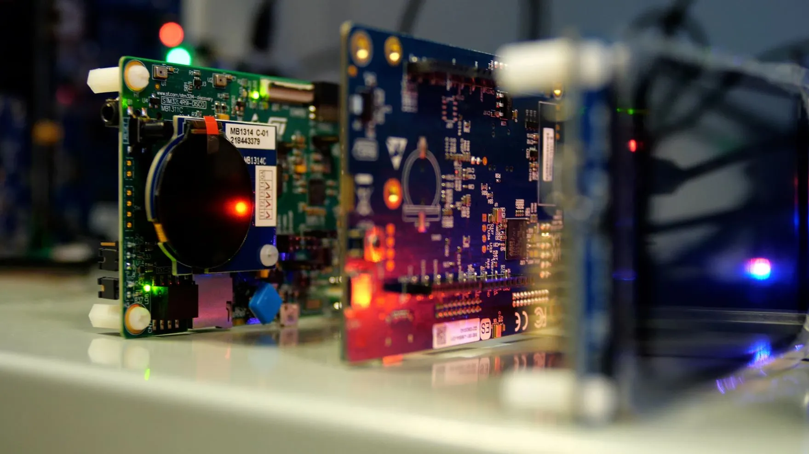

# Room Occupancy Detection

This project focuses on detecting room occupancy based on IoT sensor data using machine learning. It includes data cleaning, feature selection, modeling with hyperparameter optimization, and model interpretation.

---

## Dataset

**Room Occupancy Detection Data**

The dataset contains sensor readings collected from a room to detect occupancy status. It includes numerical features such as temperature, humidity, light, CO2 levels, and humidity ratio, with a binary occupancy target.

---

## Project Overview

### Data Cleaning & Preprocessing

- Removed outliers using the IQR method on numerical features.
- Conducted feature selection using:
  - ANOVA F-test (for categorical target and numeric features).
  - Kendall Tau correlation (rank-based, non-parametric test).
- Dropped the "Humidity" feature based on feature selection analysis.
- Split the dataset into training and testing sets (80/20 stratified split).
- Scaled features using MinMaxScaler.

### Modeling

- Trained and compared models including:
  - XGBoost Classifier with hyperparameter tuning via Bayesian optimization (Optuna).
  - Random Forest Classifier.
- Evaluated models on accuracy, confusion matrix, and memory footprint.
- Used feature importance.
